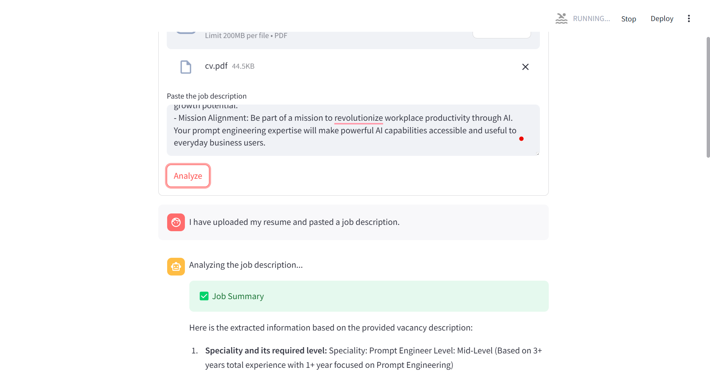
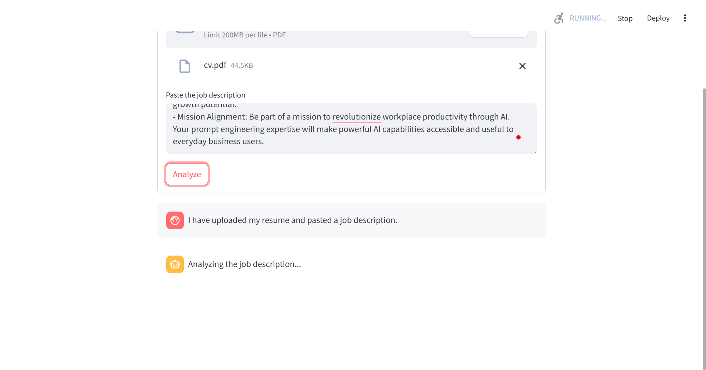
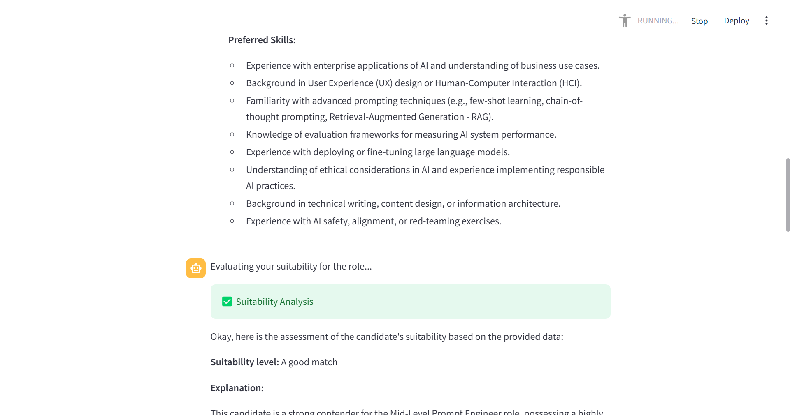
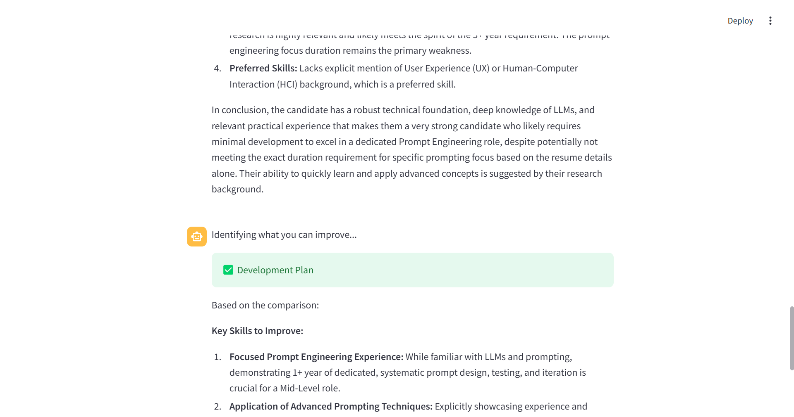

# Job Match AI Agent

## Overview
This program creates an AI Agent that assists with vacancy processing:

:white_check_mark: **Provide processed vacancy data**:
  - A speciality and its required level.
  - A short summary of this vacancy (3-5 sentences).
  - Key requirements, including skills and tech stack.

:white_check_mark: **Evaluate candidate suitability**:
  - A user's suitability for a vacancy (No matches / Require great development / Some matches / A good match / A complete match).
  - Strengths and Weaknesses based on a user's resume.

:white_check_mark: **Suggest improvements**:
  - Ways to improve so that the user gets this job.
  - The key skills to improve.
  - Links to relevant courses.

:moneybag: **Business use case**: advertising courses of an educational platform.

## Implementation
**Requiements**
```
pip install streamlit PyMuPDF google-generativeai
```

- `google-generativeai` for using Gemini models.
- `streamlit` for building a web app.
- `fitz` for file parsing (PyMuPDF).

**Run**
```
streamlit run app.py
```

**Local link**
```
http://127.0.0.1:5000/
```

**Model**
```
Gemini 2.5 Flash Preview 04-17
```

## Example:

<div style="display: flex; overflow-x: auto; white-space: nowrap;">
  
  
</div>

<!-- 




 -->
